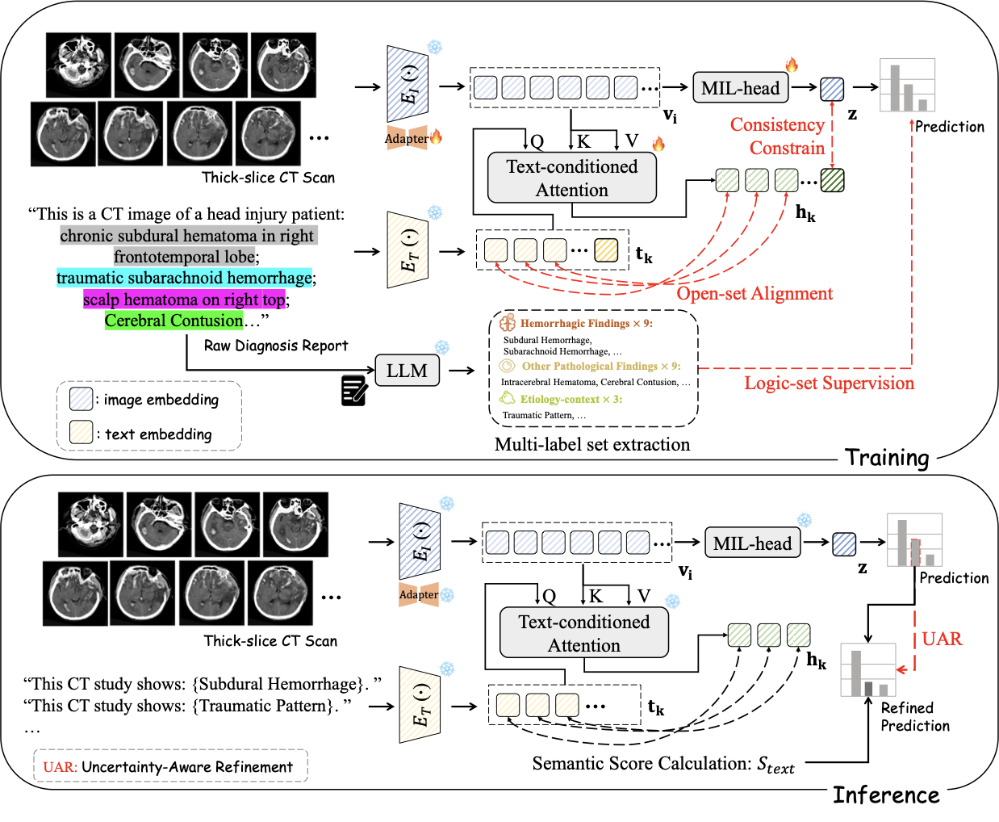

# Brain-Adapter

This is a PyTorch implementation of **Brain-Adapter: A Dual-Stream Vision-Language MIL Framework for Comprehensive 3D CT Diagnosis of Acute Intracranial Pathologies** (MICCAI 2026).

## Overview

Brain-Adapter is a dual-stream vision-language MIL framework for multi-label diagnosis on head CT volumes. It couples a global vision-language alignment stream with a logic-aware MIL stream to model both study-level semantics and fine-grained pathological cues, and further uses UAR-based refinement during inference. This repository contains the paper-core training path, UAR-based evaluation refinement, and logic-set entity extraction.



In our profiling setup on an NVIDIA GeForce RTX 4090, Brain-Adapter achieves 79.4 ms/sample latency with 1003.6 MB peak GPU memory.

## Repository Structure

- [configs](./configs): configuration system and release configs
- [data](./data): dataset and augmentation utilities
- [model](./model): CLIP-based backbones and Brain-Adapter model components
- [utils](./utils): data loading, losses, metrics, and logging
- [tools](./tools): auxiliary preprocessing scripts
- [train_combine_DDP.py](./train_combine_DDP.py): main training and evaluation entrypoint

## Training

Public release configs are provided under [configs/release](./configs/release).

Example:

```bash
python train_combine_DDP.py --config-file configs/release/brain_adapter_paper.yml
```

Backbone comparison configs:

- `configs/release/abmil_biomedclip.yml`
- `configs/release/abmil_biomedclip_vpt.yml`
- `configs/release/abmil_biomedclip_clip_adapter.yml`
- `configs/release/abmil_radclip.yml`
- `configs/release/abmil_radclip_vpt.yml`
- `configs/release/abmil_radclip_clip_adapter.yml`

Paper-oriented configs:

- `configs/release/brain_adapter_paper.yml`
- `configs/release/brain_adapter_paper_uar.yml`

## Logic-set Extraction

The repository includes a public extraction entrypoint at [tools/entity_extraction.py](./tools/entity_extraction.py). It uses an OpenAI-compatible API client and defaults to `qwen3`.

Example:

```bash
python tools/entity_extraction.py \
  --input /path/to/reports.lst \
  --output-labels /path/to/labels.lst \
  --output-json /path/to/labels.jsonl \
  --model qwen3 \
  --workers 4
```

Required environment variable:

- `OPENAI_API_KEY`

Optional environment variable:

- `OPENAI_BASE_URL`
